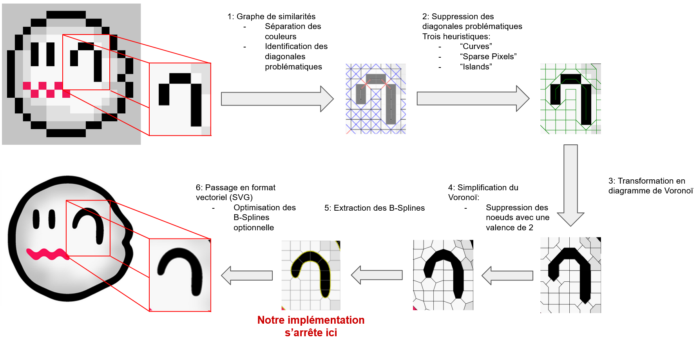

# Projet INF8801A - Session A21

Groupe A :
  - Mathis Lamidey, @Ithyx
  - Hugo Vandenbroucke-Menu, @thehyouz

Notre projet consistait à ré-implémenter en parti l'article "Depixelizing Pixel Art" de Johannes Kopf et Dani Lischinski.
Disponible ici : https://johanneskopf.de/publications/pixelart/paper/pixel.pdf

Les images utilisées proviennent du dataset de l'article.
Disponible ici : http://johanneskopf.de/publications/pixelart/supplementary/multi_comparison.html

Notre implémentation est en Python et il est possible de la lancer depuis le fichier `main.ipynb`.

## Pipeline et exemple

Pour un exemple détaillé de résultats, voir les images dans le dossier `output`.

## Requis
L'ensemble des librairies nécessaire sont décrites dans le fichier `requirements.txt`. Pour les installer, utiliser `pip install -r requirements.txt`.
Pour la bonne exécution du script, assurez-vous que le dossier `output` existe bien.

## Utilisation
Notre code est présenté sous forme d'un jupyter notebook qui fait les appels de fonctions nécessaire pour traiter les images.
Nous fournissons nos images de test dans le dossier `data`, et lors de l'exécution du notebook, en plus des images affichées directement dans le notebook, une copie sera sauvegardée dans le dossier `output` si vous changez le paramètre `saveFig` des signatures de fonction d'affichage (en utilisant les variables globales en haut du notebook).
Nous vous encourageons à tester de changer l'image en entrée du programme, en modifiant le chemin dans la cellule "Step 1", mais notez que l'algorithme ne marche bien que sur des images de pixel art en basse résolution. Si vous essayez avec une image de trop grande taille, vous risquer un temps d'exécution très long.
